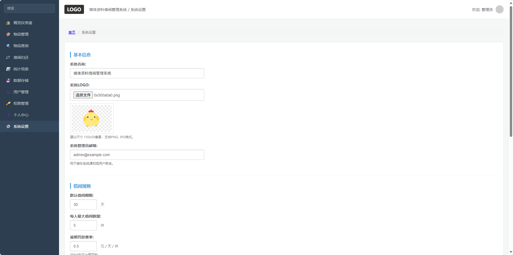

# 媒体资料借阅管理系统

## 1. 概述

媒体资料借阅管理系统是一款用于图书馆的媒体资料管理软件，能够有效地分类、管理和借阅三类媒体资料：图书、视频光盘和图画。系统支持读者和管理员角色，管理员可进行物品的添加、编辑、删除、借阅等操作，读者可进行物品的查询和借阅。

## 2. 系统功能设计

### 2.1 用户角色

*   **读者**：

    *   查询物品（按标题、编号、类别）
    *   借阅物品
    *   查看已借阅物品及借阅历史
    *   归还物品
*   **管理员**：

    *   添加物品
    *   编辑物品
    *   删除物品
    *   借阅物品
    *   统计信息
    *   存盘与读出
    *   管理读者信息（新增、编辑、删除）

### 2.2 物品分类

*   **图书**：包含编号、标题、作者、评级、出版社、ISBN号、页数
*   **视频光盘**：包含编号、标题、作者、评级、出品者、出品年份、视频时长
*   **图画**：包含编号、标题、作者、评级、出品国籍、长、宽

### 2.3 功能模块

*   **物品管理模块**：

    *   添加物品：根据类别填写相应信息，确保编号唯一。
    *   编辑物品：可修改物品信息，确保编号唯一。
    *   删除物品：根据编号删除物品。
*   **物品查询模块**：

    *   按标题、编号、类别进行查询。
    *   支持模糊查询和精确查询。
*   **借阅管理模块**：

    *   管理员为读者借阅物品。
    *   读者可归还物品，归还信息保存至文件。
    *   借阅信息保存至文件。
*   **统计信息模块**：

    *   显示物品总数及各类物品数量。
    *   按照读者统计借阅记录。
*   **数据存储模块**：

    *   物品信息、借阅信息持久化到本地文件。
*   **权限管理模块**：

    *   管理员权限分级（超级管理员、普通管理员）。
    *   读者权限限制（借阅数量、借阅时长）。

### 2.4 系统界面

*   **概览仪表盘**：


*   **物品管理**：


*   **借阅归还**：


*   **统计信息**：


*   **用户管理**：


*   **权限管理**：


*   **系统设置**：


## 3. 系统架构设计

*   **前端**：React + Tailwind CSS
*   **后端**：Node.js + Express
*   **数据库**：SQLite（轻量级，便于部署）
*   **文件存储**：本地文件系统（JSON 文件格式）
*   **部署方式**：本地安装、Docker容器部署
*   **数据流**：前端发送请求至后端，后端处理并与数据库或文件交互。

## 4. 安装教程

### 4.1 本地安装

1.  **克隆项目仓库**：

    ```shell
    git clone <repository-url>

    ```
2.  **安装依赖**：

    ```shell
    cd media-library-management
    npm install

    ```
3.  **配置数据库**：默认使用 SQLite。
4.  **启动服务**：

    ```shell
    npm run start

    ```

### 4.2 Docker部署

1.  **构建Docker镜像**：

    ```shell
    docker build -t media-library-management .

    ```
2.  **运行容器**：

    ```shell
    docker run -p 3000:3000 media-library-management

    ```

## 5. 使用说明

### 5.1 管理员操作

*   登录后可添加、编辑、删除物品。
*   可为读者借阅物品。
*   可查看统计信息。
*   可将物品信息存盘。
*   可管理读者信息。

### 5.2 读者操作

*   可按标题、编号、类别查询物品。
*   可借阅和归还物品。
*   可查看借阅历史。

## 6. 数据结构设计

*   **物品表（items）**：编号、标题、作者、评级、类别、扩展信息（JSON）
*   **借阅记录表（loans）**：借阅编号、物品编号、读者编号、借阅日期、归还日期
*   **读者表（readers）**：读者编号、姓名、最大借阅数量

